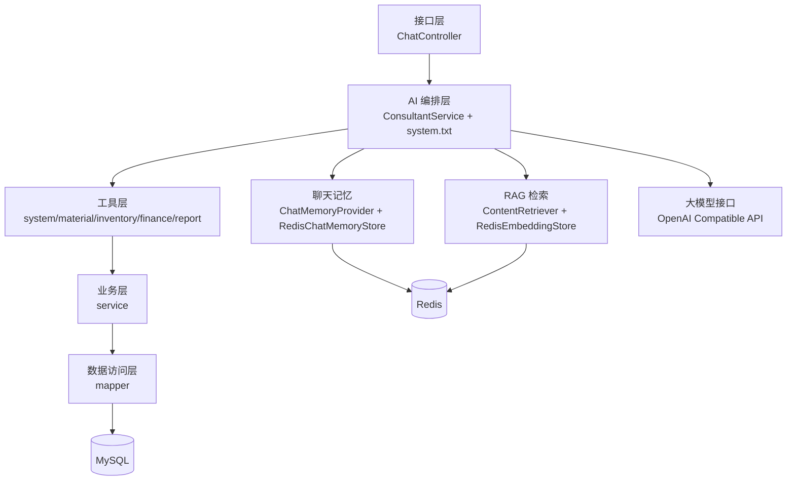
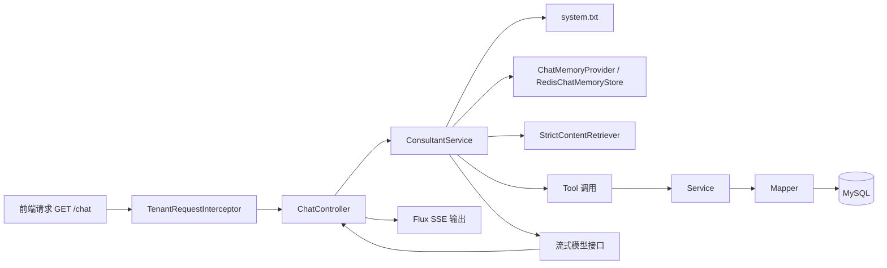
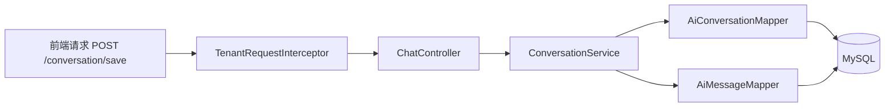

# 项目代码详解与演讲版技术白皮书

## 1. 项目一句话定位

这个项目不是一个简单的“AI 聊天 Demo”，而是一个基于 `Spring Boot + LangChain4j + MyBatis + MySQL + Redis` 搭建的企业运营 AI 中台后端。  
它的核心目标，是把大模型能力、企业 ERP 数据、知识库检索、业务工具调用、多租户隔离和会话管理真正整合起来，形成一个“会问答、会查数、会办事”的智能业务助手。

如果把这套系统用一句更适合演讲的话来概括，可以这样说：

> 这不是把大模型接进系统，而是把大模型接进业务流程。

---

## 2. 演讲开场版摘要

从业务视角看，这个项目解决的是一个非常典型的问题：  
企业内部系统里有很多数据、流程和规则，但传统 ERP 的交互方式门槛高、流程长、页面分散。用户知道系统里“有东西”，却不一定知道“在哪里找、怎么查、怎么操作”。

这个项目做的事情，是把 AI 放在 ERP 前面，作为统一入口：

1. 用户可以像聊天一样提问。
2. AI 可以结合知识库回答系统使用问题。
3. AI 可以调用业务工具查询真实 ERP 数据。
4. AI 还可以进一步执行创建单据、记账、维护资料等动作。

也就是说，这套系统不是“AI 只负责说”，而是“AI 既能理解，也能执行”。

---

## 3. 项目要解决的核心问题

### 3.1 传统企业系统的痛点

传统 ERP 类系统常见有四类问题：

1. 功能模块很多，但使用入口分散，学习成本高。
2. 数据查询往往依赖固定菜单和复杂筛选，非专业用户不易上手。
3. 跨模块业务流程割裂，用户需要自己判断去哪个页面、点哪个按钮。
4. 在多租户场景下，系统既要共享平台能力，又要保证不同租户的数据隔离。

### 3.2 本项目的回答方式

这个项目给出的方案是：

1. 用 AI 对话作为统一入口。
2. 用 `system.txt` 约束 AI 的行为边界和工具选择规则。
3. 用 LangChain4j 的 Tool 机制把 AI 意图映射到真实业务能力。
4. 用 RAG 补足“系统说明、用户手册、流程知识”类问题。
5. 用 Redis 和 MySQL 分别承担“即时记忆”和“持久归档”两类会话能力。
6. 用请求拦截器和上下文实现租户级逻辑隔离。

从产品定位上看，它已经具备一个企业级 AI 中台后端的雏形。

---

## 4. 技术栈与外部依赖

## 4.1 基础技术栈

根据 [`pom.xml`](/e:/langchain4j/demo-langchain4j/pom.xml)，项目核心技术栈如下：

- `Spring Boot 3.5.3`
- `Java 17`
- `LangChain4j 1.0.1-beta6`
- `Spring Web + WebFlux`
- `MyBatis`
- `MySQL`
- `Redis`
- `Reactor Flux`
- `PDFBox`
- `Tess4J`
- `Lombok`

这里有一个值得强调的点：项目同时引入了 `spring-boot-starter-web` 和 `spring-boot-starter-webflux`。  
这说明它并不是一个纯粹的 WebFlux 应用，而是在传统 Spring MVC 基础上，针对 AI 流式输出场景引入了响应式能力。

## 4.2 大模型接入方式

根据 [`application.yml`](/e:/langchain4j/demo-langchain4j/src/main/resources/application.yml)，项目使用的是 OpenAI 兼容协议接入模型服务：

- 聊天模型：`glm-4.7`
- 流式聊天模型：`glm-4.7`
- 向量模型：`text-embedding-v3`
- 接入地址：DashScope 兼容模式接口

这说明项目在设计上并没有把自己锁死在某个单一厂商 SDK 上，而是使用了 OpenAI 兼容协议这一层抽象。这种做法的好处是：

1. 模型切换成本更低。
2. 部署方案更灵活。
3. 后续替换为本地模型或其他兼容提供方时，改动面更小。

## 4.3 外部系统依赖

项目依赖的运行组件主要有三类：

1. `MySQL`
   - 存储 ERP 业务数据
   - 存储 AI 会话归档数据
2. `Redis`
   - 存储聊天记忆
   - 存储向量检索索引与知识库清单
3. 本地 PDF 手册
   - 作为知识库原始文档输入

---

## 5. 项目整体架构

整个系统可以概括为五层架构：

1. 接口层：负责接收 HTTP 请求和返回结果。
2. AI 编排层：负责把模型、提示词、记忆、知识检索、工具调用组织起来。
3. 能力层：负责提供知识库、聊天记忆、业务工具等 AI 可调用能力。
4. 业务层：负责业务规则、参数处理、事务管理和跨表编排。
5. 数据层：负责 MySQL、Redis、向量存储的实际读写。

这个架构最大的特点，是 AI 不是悬浮在系统之上的外挂，而是位于业务调用链中间的一个“智能调度层”。

---

## 6. 目录结构与代码分层

项目主代码位于 `src/main/java/com/example/consultant` 下，整体分层比较清晰：

- `controller`
  - 对外 HTTP 接口入口
- `aiService`
  - LangChain4j 的 AI 服务定义
- `config`
  - 记忆、RAG、多租户等基础配置
- `tools`
  - 暴露给 AI 的业务工具
- `service`
  - 业务编排层
- `mapper`
  - MyBatis 数据访问层
- `pojo`
  - 业务对象、结果对象、参数对象
- `repository`
  - 当前主要是 Redis 聊天记忆存储实现
- `rag`
  - 知识库加载、同步、检索逻辑
- `utils`
  - 用户上下文与租户工具类

这套分层最值得肯定的地方在于：  
项目没有把 AI 能力直接写死在 Controller 里，也没有把业务 SQL 混进工具层，而是保持了典型的企业应用结构。

---

## 7. 从启动入口看项目骨架

项目启动类是 [`ConsultantApplication.java`](/e:/langchain4j/demo-langchain4j/src/main/java/com/example/consultant/ConsultantApplication.java)，本身非常轻，只负责启动 Spring Boot。

这说明真正的系统装配并不靠主类硬编码，而是由 Spring 容器自动完成：

1. 扫描配置类和组件。
2. 初始化多租户拦截器。
3. 初始化聊天记忆提供器。
4. 初始化 Redis 向量存储。
5. 初始化内容检索器。
6. 初始化知识库同步任务。
7. 根据 `@AiService` 组装 AI 服务。

这种设计的优点是系统职责清晰，可维护性强。

---

## 8. 核心模块解析

## 8.1 接口层：`ChatController`

[`ChatController.java`](/e:/langchain4j/demo-langchain4j/src/main/java/com/example/consultant/controller/ChatController.java) 是对外统一入口，当前承担两类接口职责：

1. AI 对话接口
2. 会话归档管理接口

### 它暴露的核心能力

- `GET /chat`
  - 流式 AI 对话
- `GET /conversations`
  - 查询当前用户会话列表
- `GET /conversation/{memoryId}`
  - 查询指定会话详情
- `POST /conversation/save`
  - 保存或归档对话
- `DELETE /conversation/{memoryId}`
  - 删除单个会话
- `DELETE /conversations/clear`
  - 清空当前用户所有会话

### 这个控制器的价值

它不是简单地转发请求，而是把“实时对话”和“历史归档”这两类能力统一到一个 API 边界内。  
对前端来说，这样的接口设计足够直观，也便于后续扩展 Web、桌面端或移动端。

### 设计上的一个细节

`/chat` 返回的是 `Flux<String>`，并使用 `TEXT_EVENT_STREAM` 输出，这表明系统从一开始就考虑了 AI 场景下的流式交互体验，而不是一次性整段返回。

---

## 8.2 AI 编排层：`ConsultantService`

[`ConsultantService.java`](/e:/langchain4j/demo-langchain4j/src/main/java/com/example/consultant/aiService/ConsultantService.java) 是整个系统最核心的编排接口。

它通过 `@AiService` 显式声明了以下内容：

- 使用哪个聊天模型
- 使用哪个流式聊天模型
- 使用哪个聊天记忆提供器
- 使用哪个内容检索器
- 使用哪些业务工具
- 使用哪个系统提示词文件

也就是说，这个接口本身就是一份“AI 能力接线图”。

### 它当前接入的能力

- `chatModel = openAiChatModel`
- `streamingChatModel = openAiStreamingChatModel`
- `chatMemoryProvider = chatMemoryProvider`
- `contentRetriever = contentRetriever`
- `tools`
  - `systemManagementTool`
  - `materialTool`
  - `inventoryBillTool`
  - `financeTool`
  - `reportTool`

### 它的意义

这一层最大的价值，不是“让模型能回答”，而是“让模型有边界、有上下文、有工具、有证据”。

这恰恰是企业 AI 落地和普通聊天机器人最本质的区别。

---

## 8.3 AI 行为规则层：`system.txt`

[`system.txt`](/e:/langchain4j/demo-langchain4j/src/main/resources/system.txt) 是整个项目里非常关键的一份资源文件。

它承担的作用远超一般意义上的“人设提示词”，而更像一层轻量级的 AI 行为编排规则：

1. 限定回答范围
2. 约束回答风格
3. 规定什么时候应该优先调用 Tool
4. 规定什么时候必须说明“知识库证据不足”
5. 规定用户意图如何映射到不同业务模块
6. 规定常见业务对象、字段和自然语言表达的标准化规则

### 为什么这很重要

很多 AI 项目失败，不是模型不够强，而是“模型行为没有被产品化”。  
这个项目把大量业务约束前置到了 `system.txt` 中，让 AI 更像一个被训练过流程和边界的业务助手，而不是一个自由发挥的聊天模型。

从演讲角度讲，这一层非常值得作为亮点强调。

---

## 8.4 RAG 知识库模块

项目的 RAG 能力主要分布在以下几个类中：

- [`CommonConfig.java`](/e:/langchain4j/demo-langchain4j/src/main/java/com/example/consultant/config/CommonConfig.java)
- [`KnowledgeBaseIngestionService.java`](/e:/langchain4j/demo-langchain4j/src/main/java/com/example/consultant/rag/KnowledgeBaseIngestionService.java)
- [`StrictContentRetriever.java`](/e:/langchain4j/demo-langchain4j/src/main/java/com/example/consultant/rag/StrictContentRetriever.java)
- `PdfKnowledgeDocumentLoader`

### RAG 模块的职责

1. 扫描本地 PDF 文档。
2. 解析并切分文本。
3. 生成向量。
4. 写入 Redis 向量存储。
5. 在对话过程中做相似度检索。
6. 只在证据足够时返回知识片段。

### 关键配置

根据 [`application.yml`](/e:/langchain4j/demo-langchain4j/src/main/resources/application.yml)，当前 RAG 的关键参数包括：

- `min-score: 0.68`
- `max-results: 4`
- `answerable-min-score: 0.74`
- `min-segment-length: 40`
- `max-segment-size: 350`
- `overlap: 60`
- `auto-sync-on-startup: true`

### 设计亮点一：不是“搜到了就答”

`StrictContentRetriever` 的逻辑非常值得肯定。  
它不是检索到内容就直接喂给模型，而是做了进一步筛选：

1. 文本片段长度不能太短。
2. 最高分必须达到可回答阈值。
3. 只有高置信度证据才会作为内容返回。
4. 结果数量根据分数聚类动态控制为 2 到 3 条。

这意味着系统追求的不是“尽量回答”，而是“尽量基于有效证据回答”。

### 设计亮点二：知识库同步不是一次性灌库

`KnowledgeBaseIngestionService` 在启动时会自动同步知识库，但它不是简单地重复写入：

1. 先对文档做 SHA-256 摘要。
2. 与 Redis 中记录的旧摘要比较。
3. 未变化的文档跳过重建。
4. 已变化的文档先移除旧向量，再写入新向量。
5. 已从资源目录移除的文档会被清理。

这说明项目在知识库构建上已经考虑了“增量同步”和“失效清理”问题，不是实验性质的一次性导入。

---

## 8.5 聊天记忆模块

聊天记忆由以下部分协同完成：

- `chatMemoryProvider`
- `MessageWindowChatMemory`
- [`RedisChatMemoryStore.java`](/e:/langchain4j/demo-langchain4j/src/main/java/com/example/consultant/repository/RedisChatMemoryStore.java)

### 这部分在做什么

项目没有把全部历史对话直接塞回模型，而是采用了窗口型聊天记忆：

- 最大消息数：`14`
- 过期时间：`86400` 秒
- Redis Key 前缀：`erp:chat-memory`

### 设计重点

`RedisChatMemoryStore` 构建 Redis Key 时，不只使用 `memoryId`，还把以下维度拼进去：

- tenant
- user
- memory

生成出的 Key 类似于：

`erp:chat-memory:tenant:{tenantId}:user:{userId}:memory:{memoryId}`

这带来两个直接收益：

1. 同一个 `memoryId` 在不同用户、不同租户下不会串数据。
2. Redis 记忆天然具备多租户隔离语义。

这不是简单的缓存，而是结合业务上下文设计出来的会话记忆结构。

---

## 8.6 会话归档模块

会话归档主要由 [`ConversationService.java`](/e:/langchain4j/demo-langchain4j/src/main/java/com/example/consultant/service/ConversationService.java) 负责。

### 它和聊天记忆的区别

这部分需要在演讲中讲清楚，因为它是很多人第一次看代码时最容易混淆的地方。

项目里存在两套“对话数据”：

1. Redis 聊天记忆
   - 用于模型上下文记忆
   - 面向实时对话
   - 带过期时间
2. MySQL 会话归档
   - 用于历史会话持久保存
   - 面向列表查询、详情展示、删除、清空
   - 长期存储

### 会话归档的核心逻辑

`ConversationService` 会用 `tenantId:userId` 作为逻辑用户标识，并基于此：

1. 保存新会话
2. 更新已有会话
3. 查询当前用户的全部会话
4. 查询单个会话详情
5. 删除单个会话
6. 清空当前用户所有会话

### 一个必须讲清楚的事实

当前 `/chat` 接口本身并不会自动把对话落到 MySQL。  
真正的持久化是通过 `/conversation/save` 完成的。

这意味着系统把“实时对话”和“历史归档”刻意拆开了：

- 一条链路负责即时交互
- 一条链路负责持久保存

这种设计是合理的，但演讲时最好主动说明，否则评委容易误以为系统会自动归档全部聊天。

---

## 8.7 多租户隔离模块

多租户相关核心类包括：

- [`TenantConfig.java`](/e:/langchain4j/demo-langchain4j/src/main/java/com/example/consultant/config/TenantConfig.java)
- [`TenantRequestInterceptor.java`](/e:/langchain4j/demo-langchain4j/src/main/java/com/example/consultant/config/TenantRequestInterceptor.java)
- [`TenantContextHolder.java`](/e:/langchain4j/demo-langchain4j/src/main/java/com/example/consultant/config/TenantContextHolder.java)
- [`UserContextUtil.java`](/e:/langchain4j/demo-langchain4j/src/main/java/com/example/consultant/utils/UserContextUtil.java)

### 它的工作方式

项目当前采用的是“单库 + tenant 字段逻辑隔离”方案，而不是物理分库分表。

请求进入系统后，流程如下：

1. 前端传入 `X-User-Id`
2. `TenantRequestInterceptor` 读取该请求头
3. 通过 `TenantUserMapper` 查询 `tenant_id`
4. 将租户信息写入 `TenantContextHolder`
5. 后续业务层默认从上下文获取租户
6. 请求结束后清理上下文

### 默认租户策略

如果请求中没有拿到有效用户，或者租户查不到，系统会回退到默认租户 `160`。

### 为什么这个方案适合当前项目

对于演示型、样板型或中等规模系统来说，这种方案工程成本低、可维护性高，也容易与现有 ERP 表结构兼容。  
更重要的是，它已经把“租户解析”从 Controller 里抽走，放到了统一拦截器中，避免了业务代码到处手工传租户参数。

---

## 8.8 工具层：AI 到业务的桥梁

项目当前最有价值的部分之一，就是 `tools` 包。

这里的 Tool 不是普通工具类，而是 AI 可以直接调用的业务能力入口。  
它们本质上承担了“把自然语言意图翻译成 ERP 操作”的职责。

### 当前接入的工具

#### 1. `systemManagementTool`

负责系统基础管理和基础资料管理，代表能力包括：

- 查询用户
- 创建用户
- 更新用户状态
- 查询角色
- 查询组织
- 查询经手人
- 查询账户
- 查询仓库
- 查询客户/供应商/会员
- 查询计量单位
- 查询收支项目
- 查询系统配置
- 查询平台配置
- 查询消息
- 创建系统消息
- 查询日志
- 保存基础资料
- 更新基础资料启用状态

#### 2. `materialTool`

负责商品与物料资料，代表能力包括：

- 查询商品分类
- 查询商品属性
- 查询商品扩展属性
- 按名称或分类搜索商品
- 查询当前商品清单
- 查询商品详情
- 创建商品
- 保存商品基础资料
- 更新商品价格
- 查询库存

这一模块特别适合演讲时举例，因为它把“问有哪些商品”“查库存”“新建商品”三类典型需求串得很完整。

#### 3. `inventoryBillTool`

负责业务单据，代表能力包括：

- 查询业务单据
- 查询单据详情
- 创建业务单据
- 更新业务单据状态

它覆盖的是 ERP 里最典型的进销存动作，比如采购入库、销售出库、销售退货、其他出入库、调拨等。

#### 4. `financeTool`

负责财务单据，代表能力包括：

- 查询财务单据
- 查询财务单据详情
- 创建财务单据
- 更新财务单据状态

它承接的正是“收款、付款、收入、支出、转账”等业务动作，是 AI 从“会回答”走向“会办事”的关键一环。

#### 5. `reportTool`

负责报表分析，代表能力包括：

- 查询经营汇总
- 查询销售统计
- 查询采购统计
- 查询资金统计
- 查询库存预警

这个模块最能体现项目的“决策支持”属性，因为它让用户可以直接通过自然语言拿到报表数据，而不必手工钻菜单。

#### 6. `reservationTool`

项目中还实现了 `reservationTool`，能力包括：

- 新增预约信息
- 根据手机号查询预约

但需要注意的是，它目前没有注册到 `ConsultantService` 的 `tools` 列表中，  
也就是说代码已经实现了，但 AI 目前无法自动调用它。

这恰好可以作为演讲中的“可扩展性证明”。

---

## 8.9 业务层：`service`

`service` 层是整个系统真正的业务编排中枢。  
Tool 层只是 AI 可调用入口，真正的业务规则、数据拼装、事务处理和校验逻辑，都在这一层完成。

### 代表性的业务特征

#### `MaterialService`

除了查询商品，它还做了较严格的创建校验，例如：

- 分类不能为空
- 单位不能为空
- 单位 ID 不能为空
- 分类必须真实存在
- 单位必须真实存在
- 单位值必须属于所选计量单位定义

这说明项目并不是“AI 传什么就写什么”，而是保留了正常企业应用需要的业务校验。

#### `InventoryBillService`

这一层会负责：

1. 解析明细 JSON
2. 汇总金额
3. 生成业务单号
4. 写入主表和子表
5. 按入库或出库方向联动库存

#### `FinanceService`

会负责：

1. 解析财务明细
2. 汇总金额
3. 生成财务单号
4. 写入主表和子表
5. 根据财务类型联动账户余额

#### `ReportService`

负责把多张业务表聚合为面向分析的结果对象，例如经营汇总、销售统计、采购统计、资金统计和库存预警。

### 这一层的意义

如果说 Tool 层解决的是“AI 如何调用”，那么 Service 层解决的是“调用之后如何正确执行业务”。  
它保证了 AI 不会绕过企业系统原本的业务规则。

---

## 8.10 数据访问层：`mapper + pojo`

项目的数据访问采用典型的 `MyBatis + POJO` 方式。

### 优点

1. SQL 边界清晰。
2. 返回对象明确，不依赖大量 `Map` 拼装。
3. 对 ERP 这种结构化数据密集型系统比较友好。

### 值得讲的点

从当前类命名可以看出，项目大量使用了“结果对象”和“参数对象”：

- `BillSummaryResult`
- `BillDetailResult`
- `DashboardSummaryResult`
- `MaterialDetailResult`
- `FinanceRecordDetailResult`
- `ToolActionResult`

这说明开发者在有意识地控制接口语义，而不是把数据库表结构直接暴露给 AI 或前端。

---

## 8.11 前端演示页

项目在 [`static/index.html`](/e:/langchain4j/demo-langchain4j/src/main/resources/static/index.html) 中提供了一个轻量级前端页面。

### 前端技术形态

- `Vue 3`
- `Tailwind CSS`
- 原生 `fetch`
- 流式读取响应体

### 前端承担的作用

1. 作为演示入口
2. 展示流式输出效果
3. 生成 `memoryId`
4. 发起 `/chat` 请求
5. 提供新建会话、停止响应、暗色模式等基础交互

### 当前可以观察到的事实

这套前端明显是为了快速演示而构建的，优点是轻量、直接、好上手。  
但它也保留了一些历史痕迹，例如页面标题和欢迎文案与当前 ERP 场景并不完全一致，这可以视为项目早期原型演进留下的痕迹。

这不是严重问题，但在演讲中可以顺带说明：  
当前重点在后端 AI 能力与业务打通，前端主要承担演示职责。

---

## 9. 五条关键运行链路

## 9.1 应用启动链路

应用启动时的大致流程如下：

1. `ConsultantApplication` 启动 Spring Boot。
2. Spring 扫描 Controller、Service、Tool、Mapper、Config 等组件。
3. `TenantConfig` 注册 `TenantRequestInterceptor`。
4. `CommonConfig` 初始化聊天记忆提供器、Redis 向量存储和内容检索器。
5. `KnowledgeBaseIngestionService` 根据配置决定是否在启动时同步知识库。
6. LangChain4j 根据 `ConsultantService` 的 `@AiService` 定义装配 AI 服务。

这一条链路体现了项目“启动即具备完整 AI 工作能力”的工程组织方式。

---

## 9.2 `/chat` 流式对话链路

这是系统最核心的一条调用链。

按执行顺序展开，可以理解为：

1. 前端调用 `/chat?memoryId=xxx&message=xxx`
2. 请求先经过租户拦截器
3. 系统根据 `X-User-Id` 解析租户
4. `ChatController` 调用 `consultantService.chat(memoryId, message)`
5. LangChain4j 加载系统提示词
6. 读取当前 `memoryId` 对应的聊天记忆
7. 结合用户问题决定是直接回答、做知识检索还是调用工具
8. 如果调用工具，则进入 `tool -> service -> mapper -> mysql`
9. 最终通过流式模型逐段返回内容
10. Controller 用 `Flux<String>` 持续推送给前端

这一条链路非常适合演讲时重点展开，因为它能一次讲清楚：

- AI 如何接收上下文
- AI 如何接工具
- AI 如何查知识
- AI 如何返回流式结果

---

## 9.3 RAG 检索链路

当用户问的是“怎么操作”“某个模块有什么作用”“手册里怎么写”之类的问题时，系统更可能走知识检索链路。

执行过程大致如下：

1. 用户问题进入 `ConsultantService`
2. `StrictContentRetriever` 将问题转为向量
3. 在 Redis 向量存储中检索候选片段
4. 过滤低质量片段和低置信度结果
5. 给高质量片段补充来源信息，例如文档名、页码
6. 将检索到的内容交给模型参与回答

### 这一链路的核心价值

它让 AI 的回答尽量建立在项目内真实文档上，而不是纯粹依赖模型常识。  
对于企业系统来说，这一点尤其重要，因为很多问题本质上是“系统手册问题”而不是“通识问题”。

---

## 9.4 Tool 调用 ERP 能力链路

当用户问的是“帮我查一下”“帮我新增一个”“帮我开一张单”“帮我看库存”时，系统更可能走 Tool 链路。

执行过程大致如下：

1. 模型根据 `system.txt` 判断用户意图
2. 选择合适的 Tool
3. Tool 接收结构化参数
4. Service 层做参数校验和业务编排
5. Mapper 层执行 SQL
6. 结果回传给模型
7. 模型再组织成自然语言返回给用户

这条链路最能体现项目与普通问答机器人之间的差别：  
系统不是停留在“告诉你怎么做”，而是可以进一步“帮你做”。

---

## 9.5 `/conversation/save` 会话归档链路

会话归档是一条与实时聊天并列的链路。

执行过程如下：

1. 前端提交 `memoryId`、问题、回答或完整消息列表
2. 系统根据 `tenantId:userId` 确定逻辑用户
3. 判断该会话是否已存在
4. 如果存在，则更新会话并重建消息明细
5. 如果不存在，则新建会话并写入消息
6. 最终持久化到 `ai_conversation` 和 `ai_message`

这条链路说明系统已经考虑了“对话留痕”和“历史追溯”。

---

## 10. 对外接口清单

当前项目对外暴露的 HTTP 接口主要集中在 `ChatController`：

| 接口 | 方法 | 作用 |
| --- | --- | --- |
| `/chat` | `GET` | AI 流式对话 |
| `/conversations` | `GET` | 获取当前用户会话列表 |
| `/conversation/{memoryId}` | `GET` | 获取单个会话详情 |
| `/conversation/save` | `POST` | 保存或归档会话 |
| `/conversation/{memoryId}` | `DELETE` | 删除单个会话 |
| `/conversations/clear` | `DELETE` | 清空当前用户全部会话 |

从接口数量看，当前项目对外 API 其实不多，但背后的能力密度很高。  
真正的大部分业务动作，并不是以传统 REST 形式直接暴露，而是通过 AI + Tool 机制完成。

---

## 11. AI 工具能力清单

当前项目的 AI 工具能力可归纳如下：

| Tool 名称 | 作用定位 | 典型能力 |
| --- | --- | --- |
| `systemManagementTool` | 系统管理与基础资料 | 用户、角色、机构、账户、仓库、消息、日志、基础资料维护 |
| `materialTool` | 商品与物料资料 | 商品分类、商品查询、商品详情、商品创建、价格更新、库存查询 |
| `inventoryBillTool` | 业务单据 | 单据查询、单据详情、业务单创建、状态更新 |
| `financeTool` | 财务单据 | 财务单查询、详情、创建、状态更新 |
| `reportTool` | 经营分析报表 | 经营汇总、销售统计、采购统计、资金统计、库存预警 |
| `reservationTool` | 预约信息 | 新增预约、手机号查询预约，但当前未注册进 AI 服务 |

这张表非常适合在演讲中展示，因为它能快速说明：  
AI 并不是只连了一个模型，而是连了一套业务能力集。

---

## 12. 项目亮点

这一部分是演讲时最值得重点讲的内容。

## 12.1 亮点一：`@AiService` 让 AI 能力装配清晰可见

很多 AI 项目的核心逻辑散落在各处，不容易解释。  
而这个项目把模型、流式模型、聊天记忆、RAG、Tool 和系统提示词集中定义在 `ConsultantService` 上，结构一眼可读。

这对于开发、维护、演示和二次扩展都非常友好。

## 12.2 亮点二：AI 不只是回答，而是接入了 ERP 的真实业务动作

通过 Tool 机制，AI 可以从“解释型助手”升级为“执行型助手”：

- 能查系统数据
- 能看库存
- 能建商品
- 能开业务单
- 能记财务单
- 能出报表

这正是企业 AI 的真正价值所在。

## 12.3 亮点三：多租户隔离方案务实、统一、易扩展

项目没有在每个 Controller 里手写租户逻辑，而是通过拦截器统一解析租户，再由上下文向业务层透传。  
同时，会话归档和 Redis 记忆都做了租户维度隔离。

这说明设计者已经把“企业系统必须有隔离边界”这件事考虑进核心架构，而不是后补。

## 12.4 亮点四：Redis 被一体化复用

Redis 在这个项目里不是只做缓存，而是同时承担了：

1. 聊天记忆存储
2. 向量检索存储
3. 知识库清单管理

这体现出底层基础设施的复用能力，也让整体架构更轻。

## 12.5 亮点五：RAG 不是“拼接文档”，而是做了证据过滤

`StrictContentRetriever` 明确区分：

- 可作为回答依据的高置信度结果
- 不能支撑确定性回答的低质量结果

这比“搜到什么就喂什么”的简单 RAG 更适合企业场景，也更容易减少错误回答。

## 12.6 亮点六：知识库同步支持增量更新与失效清理

知识库同步不是一次性灌库，而是：

- 比较文档摘要
- 跳过未变化文档
- 重建变化文档
- 删除失效文档

这个细节非常加分，因为它体现了项目的工程成熟度。

## 12.7 亮点七：流式返回提升了演示效果与交互体验

AI 能力演示最怕“用户问完，长时间无反馈”。  
项目通过 `Flux<String> + SSE` 做流式返回，让回答过程可见，这对演讲展示非常友好。

## 12.8 亮点八：虽然测试不算全面，但关键边界已经有覆盖

从测试代码可以看出，项目已经覆盖了几个很关键的边界：

- `MaterialServiceTest`
  - 校验商品创建时的分类、单位、单位 ID、单位定义合法性
- `StrictContentRetrieverTest`
  - 校验低分结果拒答、高分结果补充来源信息
- `KnowledgeBaseIngestionServiceTest`
  - 校验未变更文档跳过、已变更文档重建
- `RedisChatMemoryStoreTest`
  - 校验聊天记忆 Redis Key 的租户/用户隔离
- `ConsultantApplicationTests`
  - 校验 Spring 上下文可正常启动

这说明项目已经具备一定工程意识，而不是只追求“先跑起来”。

---

## 13. 当前不足与可演进点

这部分不建议回避，反而应该主动讲，因为它会让整个项目显得更真实、更成熟。

## 13.1 `reservationTool` 已实现但未接入主 AI 服务

这意味着系统已经具备新增预约和按手机号查询预约的能力雏形，但目前还没有被纳入主对话链路。  
从工程角度看，这不是缺失，而是一个非常明确的待接入扩展点。

## 13.2 实时聊天与持久归档是解耦的

`/chat` 不会自动落库到 MySQL，前端需要额外调用 `/conversation/save`。  
这本身并不是错误，但如果未来要面向真实生产场景，可能需要进一步评估：

1. 是否自动归档
2. 归档时机怎么定义
3. 失败重试机制如何处理

## 13.3 前端文案与当前 ERP 场景存在历史残留

从静态页面内容可以看到，前端文案并非完全围绕当前 ERP 项目定制。  
这说明前端更偏演示样板，而不是最终业务界面。

对于答辩来说，这反而是一个容易解释的点：  
本项目的重点是后端 AI 能力与业务系统打通，前端目前承担的是轻量演示职责。

## 13.4 代码与文档中仍存在乱码痕迹

当前仓库中部分中文注释、资源和旧文档存在编码问题。  
这通常说明项目在某个阶段经历过编码环境不统一的问题。

这不是架构问题，但确实会影响可维护性。  
后续建议统一为 UTF-8，并对资源文件和源码注释做一次系统清理。

## 13.5 测试覆盖仍有扩展空间

现有测试覆盖了部分关键边界，但仍然偏模块级。  
未来如果要进一步走向生产级，建议补充：

1. Tool 到 Service 的集成测试
2. 会话归档接口测试
3. 多租户隔离测试
4. 更完整的 RAG 端到端测试

---

## 14. 这个项目为什么值得拿去演讲

如果从评委视角看，一个项目值不值得讲，通常看三个问题：

1. 它解决的问题是否真实
2. 它的技术方案是否成体系
3. 它是否体现了从 Demo 到系统的跃迁

这个项目在这三点上都具备较好的表现。

### 第一，它解决的是企业系统与 AI 结合的真实问题

不是泛泛而谈“做一个聊天机器人”，而是明确围绕 ERP 场景，把查数、问答、开单、记账、报表分析统一到 AI 入口。

### 第二，它的架构是完整的

它不仅有模型接入，还有：

- 行为规则层
- RAG 知识库
- Tool 调用链
- 业务层
- 数据层
- 多租户隔离
- 会话记忆与归档

这说明它已经形成了完整的系统闭环。

### 第三，它最有价值的地方是“AI 真正接进了业务”

很多项目只是把大模型接在网页上。  
而这个项目真正有说服力的地方在于：AI 已经可以成为 ERP 的自然语言入口。

这就是它最适合演讲的核心卖点。

---

## 15. 适合现场演讲的收束总结

如果这份文档要收束成一段现场总结，可以这样表达：

> 这个项目的核心价值，不在于“接入了一个大模型”，而在于把大模型真正接进了企业业务系统。  
> 它通过 LangChain4j 把模型、记忆、知识库和工具能力编排起来，让 AI 既能理解用户问题，又能连接真实 ERP 数据和业务流程。  
> 在此基础上，项目还进一步考虑了多租户隔离、知识库增量同步、流式交互和会话归档等工程问题。  
> 所以它展示的不是一个聊天演示，而是一套面向企业运营场景的 AI 中台后端雏形。

---

## 16. 一句话总结

这个项目本质上是一套“以 AI 为入口、以 Tool 为桥梁、以 ERP 数据为落点、以多租户和记忆机制为保障”的企业运营 AI 后端系统。
